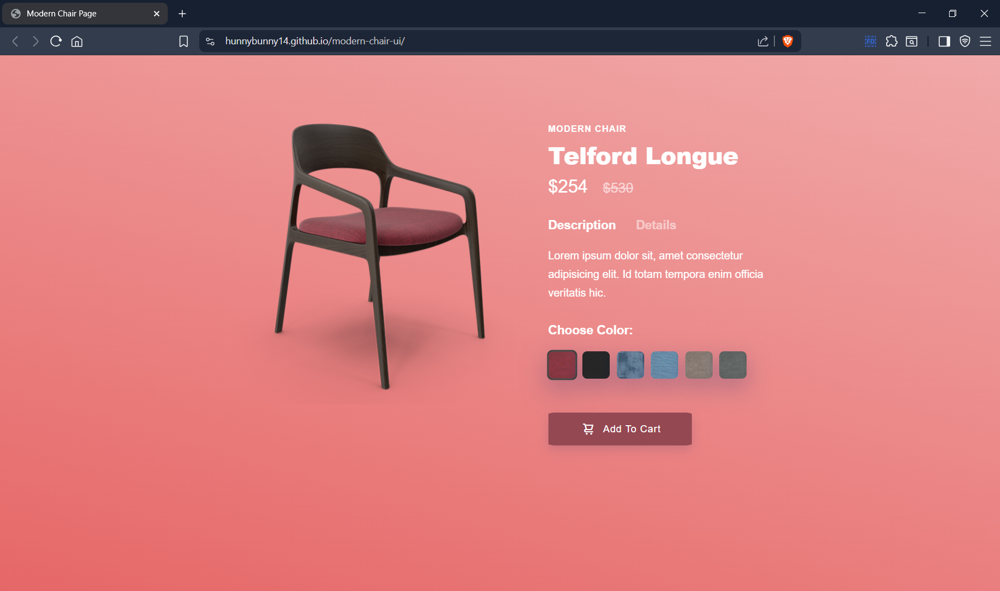

# 🪑 Modern Chair UI

A modern and responsive product showcase page built with **HTML** and **CSS**. This project demonstrates how interactive product selection, animations, and dynamic UI elements can be achieved without using JavaScript.

---

## 🚀 Live Demo
🔗 [View on GitHub Pages](https://hunnyBunny14.github.io/modern-chair-ui/)

---

## 🎯 Features

- ✅ Clean and responsive design
- 🎨 Interactive color switcher
- 🪑 Dynamic chair image & background gradient transitions
- 🔄 Description toggle using radio buttons
- 💯 Pure HTML & CSS (No JavaScript)

---

## 🛠️ Tech Stack

- HTML5
- CSS3
- Google Fonts & IconScout (Unicons)
- Responsive Design
- GitHub Pages (deployment)

---

## 📂 Folder Structure

modern-chair-ui/
├── index.html
├── styles.css
└── Images/
├── chair1.png
├── chair2.png
├── ...
├── color6.jpg
└── screenshot.png
---

## 📸 Screenshots

| Default View | Switched Color |
|--------------|----------------|
|  |  |

---

## 🙌 Acknowledgements

- Inspired by modern UI/UX product pages
- Fonts from [Google Fonts](https://fonts.google.com/)
- Icons from [IconScout Unicons](https://iconscout.com/unicons)

---

## 🧠 What I Learned

> I learned how to create a fully interactive and dynamic UI using only HTML and CSS. Leveraging radio buttons, CSS transitions, and background effects was a great deep dive into front-end creativity.

---

## 👤 Author

**Hunny Dhingia**  
🚀 B.Tech CSE (AI & ML) | Graphic Era University  
📅 Batch: 2024–2028  
🔗 [GitHub](https://github.com/hunnyBunny14)  
🔗 [LinkedIn](https://www.linkedin.com/in/hunnyBunny14)

---

## ⭐ Show Some Love

If you found this project helpful or inspiring, leave a ⭐ and share it with your circle.  
Let’s build awesome UIs together!

